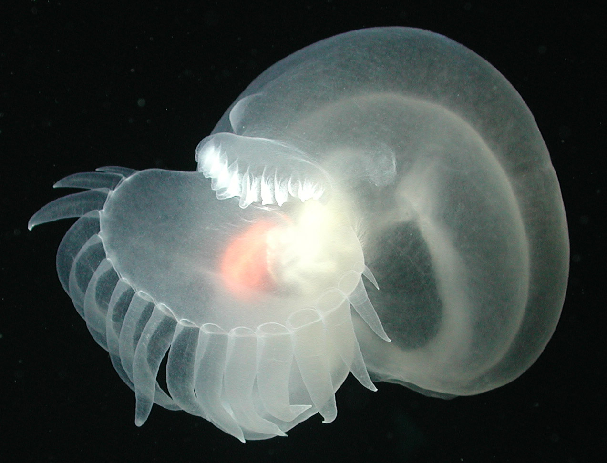
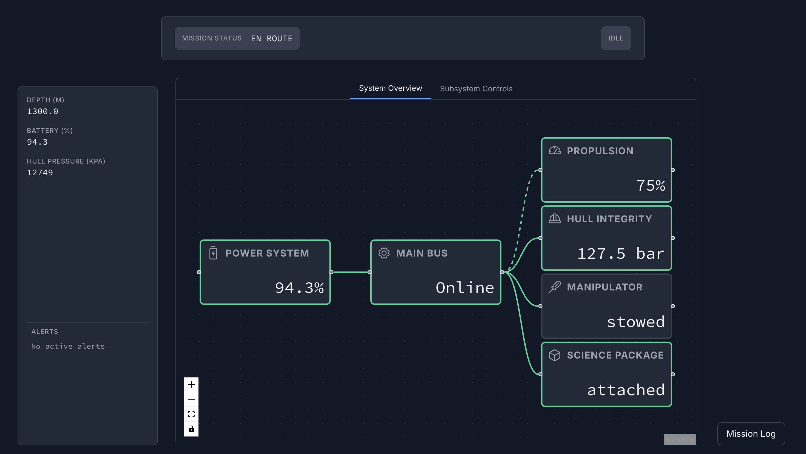

# 🌊 Odyssey ROV HMI

[](https://github.com/thethyka/Odyssey-ROV-Interface/actions/workflows/ci.yml)

🔴 **Live demo:** [thethyka.github.io/Odyssey-ROV-Interface](https://thethyka.github.io/Odyssey-ROV-Interface/) · Backend: [odyssey-rov-backend.fly.dev](https://odyssey-rov-backend.fly.dev/healthz)

We’ve just heard word there’s a new deep-sea bioluminescent sea slug, *Bathydevius caudactylus*, spotted off the coast of California, 2000m deep in a trench!
Apparently, it has a starry, mesmerizing effect.



We need to FIND THIS SLUG!! for *science*, of course.

The mission: Using a HMI to control a ROV, the Odyssey, navigate to and collect a rare bioluminescent sea slug (*Bathydevius caudactylus*), and return it to a collection pod. 

---

## 📂 Project Structure
```
odyssey-rov-hmi/
├── backend/             # FastAPI app
├── docs/                # HMI Philosophy, Design and Overview
├── frontend/            # React + Vite + TS + Tailwind v4 app
├── proto/               # gRPC contract files
├── docker-compose.yml   # Dev orchestrator (backend + frontend with hot reload)
└── .dockerignore
```
---

## 🔑 Docs

- **[Philosophy](docs/philosophy.md)**: The "why" — mission, operator goals, and design principles.
- **[Style Guide](docs/style-guide.md)**: The "how" — colors, typography, icons, and layout rules.
- **[Toolkit](docs/toolkit.md)**: The "what" - Reusable UI components, core objects, and gRPC services.
- **[Stories](docs/stories.md)**: Set of simulation stories for our HMI, since the ROV is simulated.

---

## 🖼️ Screenshots



---


## 🔑 Backend

The backend simulates the ROV's state and environment. It streams real-time telemetry (depth, power, system status) to the frontend via WebSockets and serves historical data on demand via a gRPC service.

---

## 🔑 Frontend

The frontend is the operator's HMI for the mission. It renders the live telemetry from the backend, providing critical situational awareness. It displays system status, alerts, and environmental data to help the operator find the slug and monitor ROV health.

---

## 🔑 Protocol Buffers

The `proto` files define the strict data contract for the gRPC `AlertService`. This ensures type-safe communication between the frontend and backend when requesting historical data like past alerts.

---

## 🔑 Docker & Dev Environment

- **Compose services**:  
  - **backend** → Python 3.11 slim, runs FastAPI with autoreload  
  - **frontend** → Node 22 alpine, runs Vite dev server with hot reload  
- **Access**:  
  - Frontend → [http://localhost:5173](http://localhost:5173)  
  - Backend → [http://localhost:8000](http://localhost:8000)  

---

## 🚀 Quickstart
Ensure you have docker installed

```bash
# Start both backend + frontend with hot reload
docker compose up

```
⸻
````
